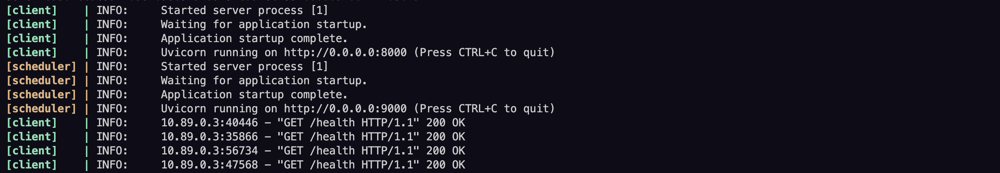

## Containerization of microservice applications


- **Task 1**: Containerize a single FastAPI application
- **Task 2**: Create a second app that calls the first every 10 seconds and deploy both in a shared network

---

## Project Structure

```
├── client_service.py            # Task 1 app: exposes health and API endpoints
├── scheduler_service.py         # Task 2 app: call the client service every 10 seconds
├── Dockerfile.client            # Dockerfile for client service
├── Dockerfile.scheduler         # Dockerfile for scheduler service
├── podman-compose.yml           # Multi-container setup
├── task1_requirements.txt       # Dependencies for client service
└── task2_requirements.txt       # Dependencies for scheduler service
```

---

## Task 1 – Single Containerized App (Client Service)

A client service has endpoints such as `/` and `/health'.

### Build and Run

```bash
podman build -f Dockerfile.client -t hw3-client .
podman run -d --name client -p 8000:8000 hw3-client
```

### Test the App

```bash
curl http://localhost:8000/
curl http://localhost:8000/health
```
  


### Check service logs


---

## Task 2 – Multi-Container App with Scheduler


### Build and Launch with Podman Compose

```bash
podman-compose up --build
```



---

## Tear Down

```bash
podman-compose down
```

## Notes
- The Client Service does not rely on other microservices here (as it did in the HW#2) — it has only health and default endpoints.

