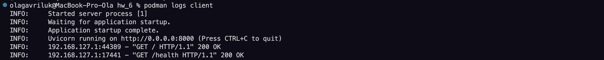

## Containerization of microservice applications

This project demonstrates containerization of two FastAPI-based microservices using **Podman** and **Podman Compose**:

- **Task 1**: Containerize a single FastAPI application
- **Task 2**: Create a second app that calls the first every 10 seconds and deploy both in a shared network

---

## 📁 Project Structure

```
├── client_service.py            # Task 1 app: exposes health and API endpoints
├── scheduler_service.py         # Task 2 app: call the client service every 10 seconds
├── Dockerfile.client            # Dockerfile for client service
├── Dockerfile.scheduler         # Dockerfile for scheduler service
├── podman-compose.yml           # Multi-container setup
├── task1_requirements.txt       # Dependencies for client service
└── task2_requirements.txt       # Dependencies for scheduler service
```

---

## 🚀 Task 1 – Single Containerized App (Client Service)

The **Client Service** is a simple FastAPI app exposing endpoints like `/` and `/health`.

### ✅ Build and Run

```bash
podman build -f Dockerfile.client -t hw3-client .
podman run -d --name client -p 8000:8000 hw3-client
```

### 🔍 Test the App

```bash
curl http://localhost:8000/
curl http://localhost:8000/health
```
  


### Check service logs


---

## 🔁 Task 2 – Multi-Container App with Scheduler

The **Scheduler Service** is a second FastAPI app that every 10 seconds sends GET requests to the Client Service.

### 🛠 Build and Launch with Podman Compose

```bash
podman-compose up --build
```

### 📜 Scheduler Output (Logs)

You should see log output like:

```bash
[Scheduler] r.status_code=200 r.text[:80]='{"status":"ok"}'
```

Every 10 seconds, the scheduler will poll `http://client:8000/health`.


### 📸 Screenshot: Terminal logs from scheduler

> _Insert screenshot showing scheduler logs calling client_

---

## 📤 Tear Down

```bash
podman-compose down
```
---

## 📝 Notes

- No external database or OpenRouter API is needed for this task.
- The Client Service does not rely on other microservices here — its health endpoint works standalone.

